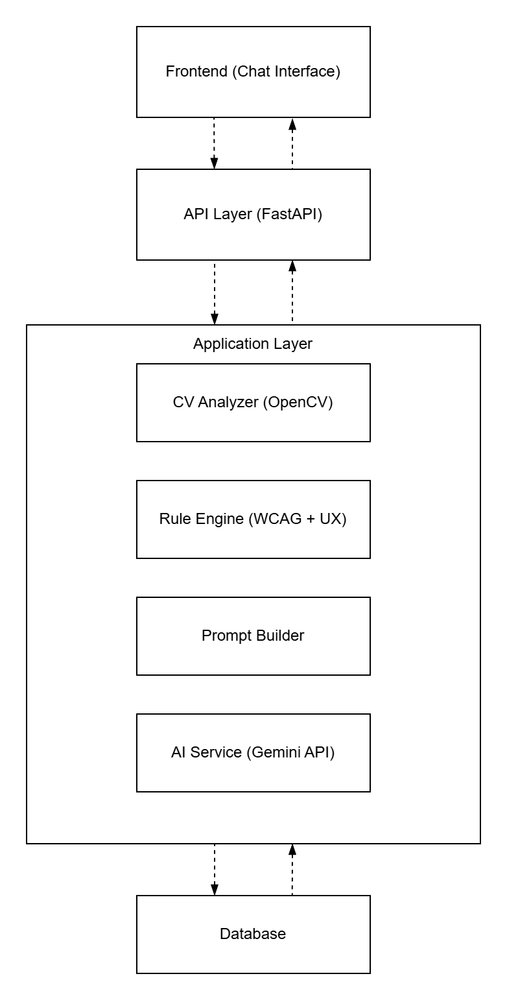
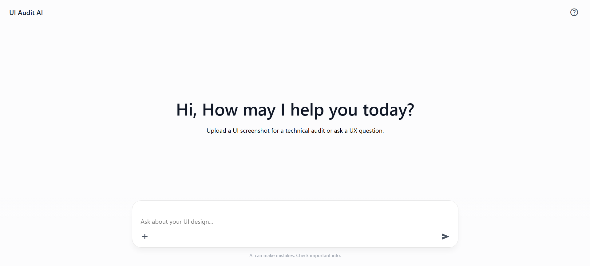
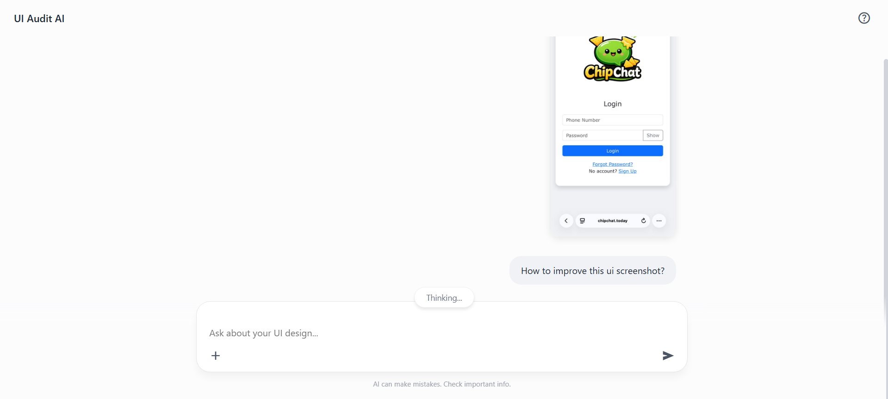
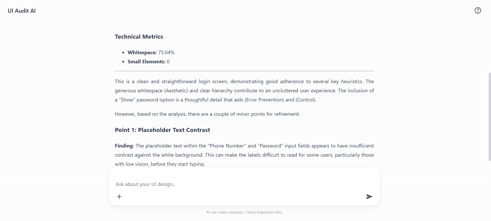
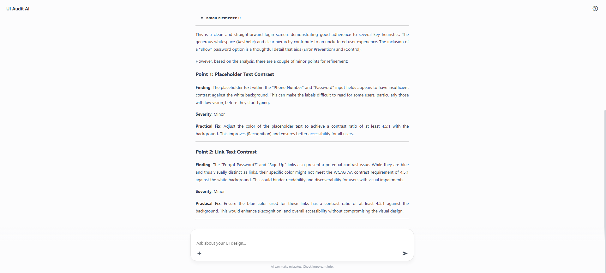

# Design Assistant
AI-powered chatbot that evaluates UI screenshots and textual descriptions to identify usability and accessibility issues using computer vision, rule-based auditing, and generative AI.

## Project Overview
Design Assistant helps designers and non-designers improve user interfaces by analyzing screenshots and generating recommendations based on usability heuristics and accessibility guidelines.

The system combines OpenCV analysis, rule-based evaluation, and Gemini AI to provide actionable UI improvement suggestions.

This project was developed as a Final Year Project (FYP) for the Bachelor of Science (Hons) Computer Science (Artificial Intelligence) programme.

## Research Contribution

This project combines computer vision techniques, rule-based usability evaluation, and generative AI to assist users in identifying usability and accessibility issues in user interface designs.

Unlike traditional chatbot systems, the primary contribution of the project lies in the backend analysis pipeline, where OpenCV metrics, WCAG accessibility checks, and Nielsen heuristic evaluations are combined before generating AI recommendations.

## Features
- Upload UI screenshots for analysis
- Submit textual UI descriptions
- OpenCV-based UI analysis
- Rule-based usability auditing
- Nielsen Heuristics evaluation
- WCAG accessibility checks
- AI-generated improvement suggestions
- FastAPI backend
- MongoDB result storage
- Chat-style interaction interface

## How It Works

1. User uploads a UI screenshot or submits a textual description.
2. FastAPI receives and validates the request.
3. OpenCV extracts interface metrics and visual information.
4. The rule engine evaluates usability and accessibility issues based on WCAG and Nielsen heuristics.
5. A prompt builder combines analysis results and user context.
6. Gemini AI generates actionable UI improvement suggestions.
7. Results are stored in MongoDB and returned through the chatbot interface.

## Technologies

### Backend
- Python
- FastAPI
- OpenCV
- Google Gemini 2.5 Flash
- MongoDB

### Frontend
- HTML
- CSS
- JavaScript

## System Architecture
Frontend → FastAPI → OpenCV Analysis → Rule Engine → Prompt Builder → Gemini AI → MongoDB   



## Folder Structure

```text
README.md
.gitignore
.env.example

src/
├── backend/
└── frontend/

report/
presentation/
screenshots/
```

## Screenshots

### Home Page


### Screenshot Analysis


### AI Recommendations



## Documentation
- Final Year Project Report (PDF)
- Presentation Slides (PPTX)

## Author

Kenneth Chong

Bachelor of Science (Hons) Computer Science (Artificial Intelligence)
